# מדריך למשתמש - מערכת ניהול חוות דעת רפואיות

מערכת לניהול תהליך כתיבת חוות דעת רפואיות עבור פרופסורים מומחים. המערכת קולטת פניות מהדואר האלקטרוני, מסדרת את החומר בתיקיות במחשב, מנהלת את התהליך מקבלת המייל ועד שליחת חוות הדעת, וחוסכת זמן על ידי חילוץ אוטומטי של פרטים ממיילים ומסמכים.

---

## תוכן עניינים

1. [התקנה ראשונית](#התקנה-ראשונית)
2. [הגדרות ראשוניות](#הגדרות-ראשוניות)
3. [לוח בקרה](#לוח-בקרה)
4. [ניהול תיקים](#ניהול-תיקים)
5. [יצירת תיק חדש](#יצירת-תיק-חדש)
6. [ייבוא תיקים מהדואר](#ייבוא-תיקים-מהדואר)
7. [פרטי תיק ועריכה](#פרטי-תיק-ועריכה)
8. [יצירה ושליחה של חוות דעת](#יצירה-ושליחה-של-חוות-דעת)
9. [ניהול שדות מותאמים אישית](#ניהול-שדות-מותאמים-אישית)
10. [עדכוני תוכנה](#עדכוני-תוכנה)
11. [שאלות נפוצות](#שאלות-נפוצות)

---

## התקנה ראשונית

### דרישות מערכת
- **Windows 10 / 11** (האפליקציה נבדקה גם על macOS לפיתוח)
- **חיבור לאינטרנט** (לסריקת מיילים ועדכונים)
- **Google Chrome** מותקן

### הורדה והתקנה
1. גש אל [דף ההורדות ב-GitHub](https://github.com/tal2420/MedicalOpinion/releases/latest)
2. הורד את הקובץ **`MedicalOpinion_Setup_X.Y.Z.exe`** (מתקין מלא, מומלץ)
   או **`MedicalOpinion_Portable_X.Y.Z.zip`** (גרסה ניידת ללא התקנה)
3. הפעל את המתקין ועקוב אחר ההוראות (אישור התקנה → מיקום → סיום)
4. בסיום ההתקנה תופיע אייקון על שולחן העבודה ובתפריט התחל

---

## הגדרות ראשוניות

לפני השימוש הראשון, יש להגדיר את פרטי המערכת. לחץ על **הגדרות** בסרגל הצדדי.

### תיקיית עבודה
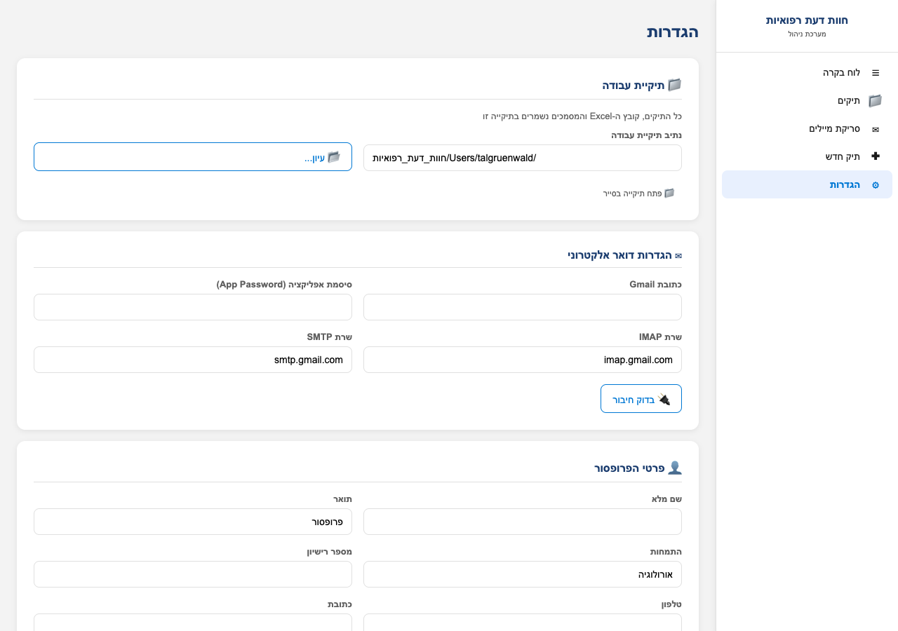

זוהי התיקייה שבה יישמרו כל התיקים, קובץ ה-Excel המרכזי, תבנית חוות הדעת והגדרות המערכת. ברירת המחדל היא `~/חוות_דעת_רפואיות`. אפשר לשנות את המיקום באמצעות כפתור **"עיון..."**.

> 💡 **טיפ**: בחר תיקייה שמגובה אוטומטית (Google Drive / OneDrive / Dropbox) כדי שכל התיקים יהיו מסונכרנים בענן.

### הגדרות דואר אלקטרוני
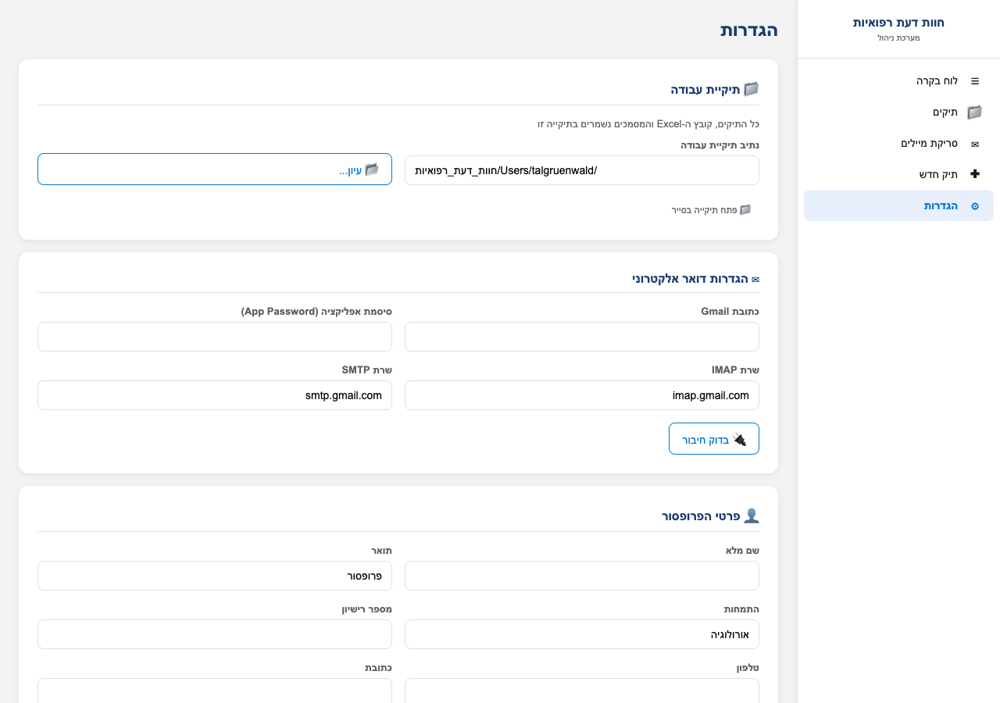

המערכת תומכת ב-IMAP+SMTP (מתאים ל-Gmail, Outlook ושירותי דואר אחרים).

**עבור Gmail:**
1. הפעל **אימות דו-שלבי** בחשבון Google שלך
2. צור **App Password** ב-[myaccount.google.com/apppasswords](https://myaccount.google.com/apppasswords)
3. הזן את כתובת ה-Gmail ואת ה-App Password (16 תווים, ללא רווחים) בשדות
4. השרתים `imap.gmail.com` ו-`smtp.gmail.com` כבר מוגדרים כברירת מחדל
5. לחץ **"בדוק חיבור"** לוודא שהכל עובד

> 📖 **מדריך מפורט צעד-אחר-צעד**: [מדריך App Password ו-IMAP](מדריך_App_Password.md)

> ⚠️ **חשוב**: ה-App Password אינו הסיסמה הרגילה שלך - זוהי סיסמה ייעודית שיוצרת Google עבור אפליקציות צד שלישי.

### פרטי הפרופסור
מתחת להגדרות הדואר, מלא את:
- שם מלא
- תואר (פרופסור / דוקטור)
- התמחות (אורולוגיה / קרדיולוגיה / וכו')
- מספר רישיון
- טלפון וכתובת

הפרטים הללו מופיעים בכותרת של מסמכי חוות הדעת שנוצרים אוטומטית.

לחץ **"שמור הגדרות"** בסיום.

---

## לוח בקרה

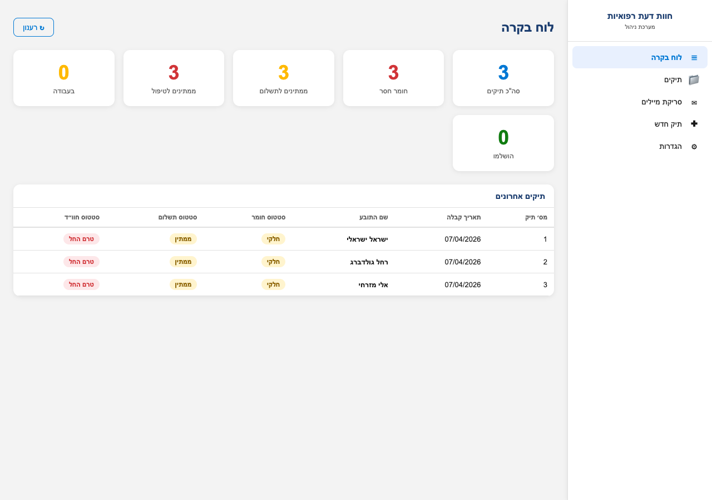

המסך הראשי מציג סקירה כללית של כל התיקים:

| כרטיס | משמעות |
|---|---|
| **סה"כ תיקים** | כמות התיקים הכוללת במערכת |
| **ממתינים לטיפול** | תיקים חדשים שעדיין לא נוגעו (סטטוס "טרם החל") |
| **בעבודה** | תיקים שהחלה עבודה עליהם |
| **הושלמו** | תיקים שחוות הדעת הושלמה / נשלחה |
| **חומר חסר** | תיקים עם סטטוס חומר "חלקי" או "חסר" |
| **ממתינים לתשלום** | תיקים שטרם שולמו |

מתחת לכרטיסים מוצגת **טבלת התיקים האחרונים**. לחיצה על שורה פותחת את פרטי התיק.

---

## ניהול תיקים

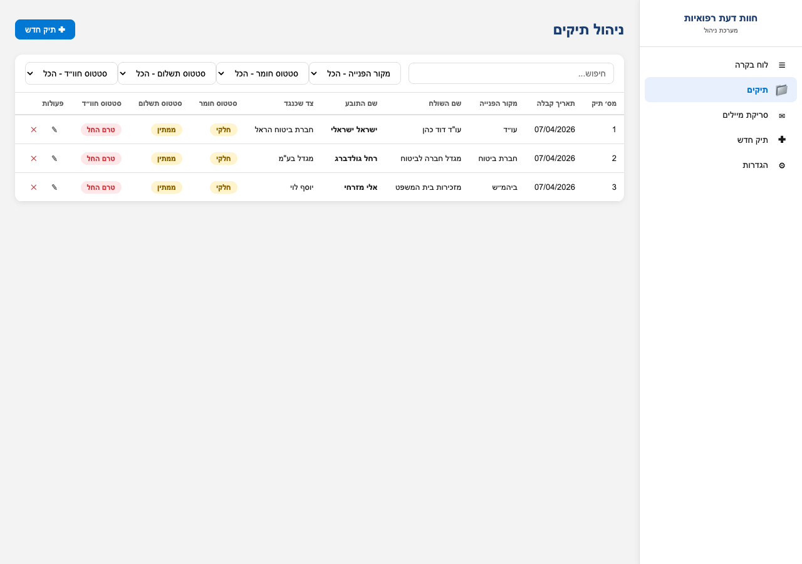

מסך **תיקים** מציג את כל התיקים בטבלה אחת עם:
- **חיפוש חופשי** - מחפש בכל השדות (שם, ת.ז., נושא, מקור)
- **פילטרים** - מקור הפנייה, סטטוס חומר, סטטוס תשלום, סטטוס חוו"ד
- **כפתורי פעולה** בסוף כל שורה: ✎ עריכה, ✕ מחיקה
- **סימוני סטטוס בצבע** - אדום (טרם), צהוב (בעבודה), ירוק (הושלם)

לחיצה על שורה פותחת את **פרטי התיק** המלאים.

---

## יצירת תיק חדש

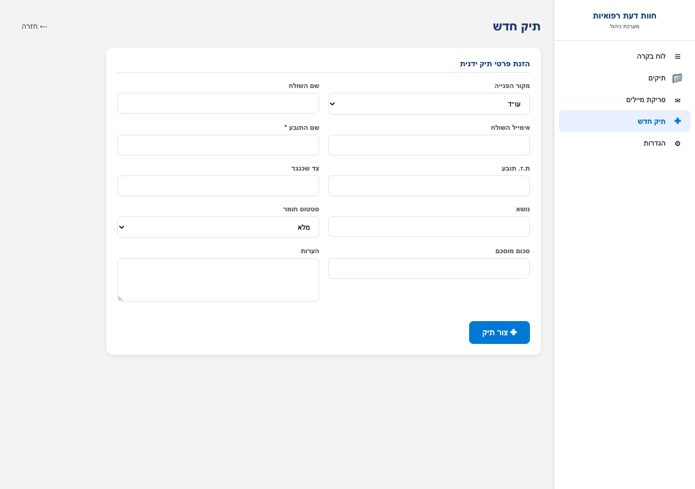

לחיצה על **"+ תיק חדש"** פותחת טופס להזנה ידנית. השדות החובה מסומנים בכוכבית (*).

מלא את הפרטים שיש לך ולחץ **"צור תיק"**. המערכת תיצור:
- שורה חדשה ב-Excel המרכזי
- תיקייה פיזית במחשב עם המבנה: `[תאריך]_[שם_תובע]_תיק_[מספר]/`
- קובץ `פרטי_תיק.csv` לקריאה ב-Excel גם ללא האפליקציה

---

## ייבוא תיקים מהדואר

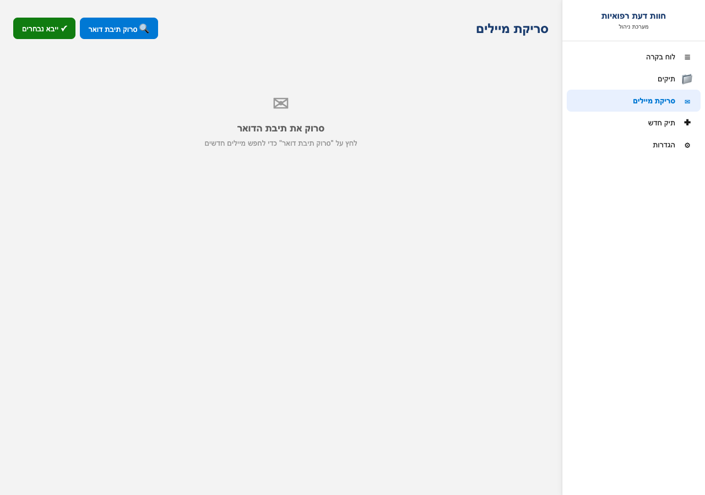

זה הכלי החזק ביותר במערכת. במקום להזין כל תיק ידנית:

1. לחץ על **"סריקת מיילים"** בסרגל הצדדי
2. לחץ **"סרוק תיבת דואר"** - המערכת מחפשת מיילים חדשים שלא נקראו
3. תיפתח רשימה של המיילים החדשים עם נושא, שולח, תאריך, וקבצים מצורפים
4. סמן את המיילים שברצונך לייבא
5. לחץ **"ייבא נבחרים"**

מה קורה אז (אוטומטית):
- ✅ נוצר תיק חדש לכל מייל נבחר
- ✅ הקובץ המקורי של המייל נשמר כ-HTML
- ✅ כל הקבצים המצורפים יורדים לתיקיית **"מצורפים"**
- ✅ המערכת **קוראת** את תוכן ה-PDF/Word בתוך המצורפים
- ✅ המערכת מחלצת אוטומטית: שם תובע, ת.ז., צד שכנגד, מספר תיק, תאריך אירוע, טלפון, כתובת, ועוד
- ✅ זיהוי אוטומטי של מקור הפנייה (עו"ד / חברת ביטוח / בית משפט / פרטי) לפי דומיין השולח ומילות מפתח
- ✅ הערכה האם החומר מלא או חלקי לפי סוגי הקבצים שצורפו
- ✅ המייל מסומן כנקרא בתיבה

> 💡 **טיפ**: גם מסמכים סרוקים כתמונה (ללא טקסט) - המערכת תשמור אותם בתיקייה. רק מסמכים עם טקסט נסרקים לחילוץ פרטים. אם המסמכים שלך הם תמונות סרוקות, ייתכן שתצטרך להזין חלק מהפרטים ידנית.

---

## פרטי תיק ועריכה

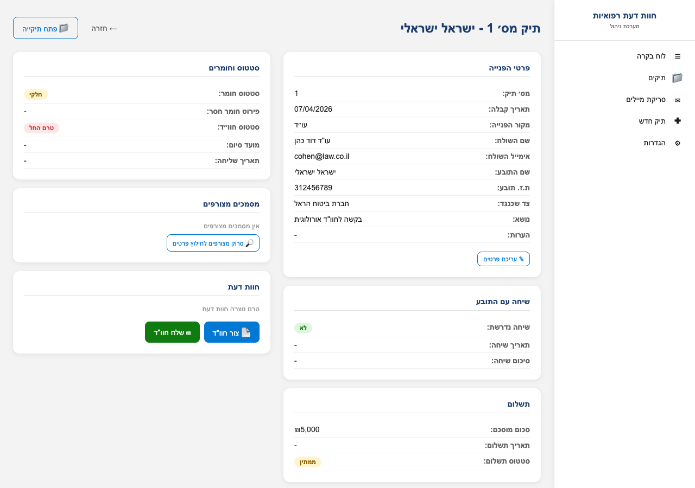

לחיצה על תיק ברשימה פותחת תצוגה מפורטת המחולקת לקבוצות:

### עמודה ימנית
- **פרטי הפנייה** - מקור, שולח, תובע, ת.ז., צד שכנגד, נושא, הערות
- **שיחה עם התובע** - האם נדרשה שיחה, תאריך, סיכום
- **תשלום** - סכום מוסכם, תאריך תשלום, סטטוס

### עמודה שמאלית
- **סטטוס וחומרים** - סטטוס חומר, חומר חסר, סטטוס חוו"ד, מועד סיום
- **מסמכים מצורפים** - רשימת כל הקבצים שירדו מהמייל
- **חוות דעת** - מסמכי ה-Word שנוצרו

### עריכת תיק
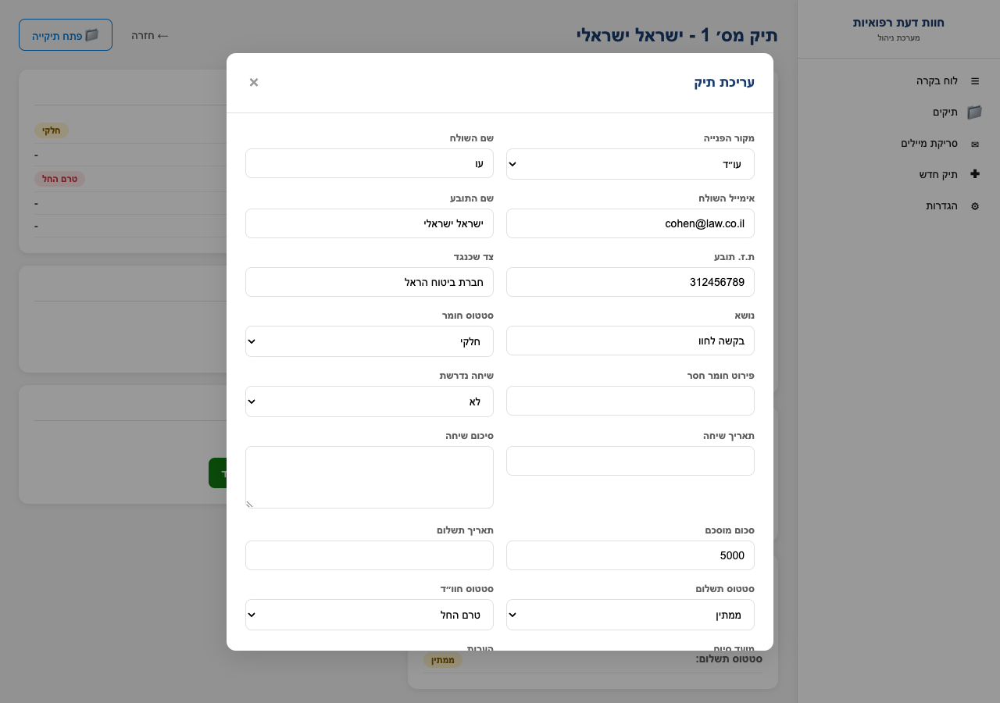

לחץ על **"עריכת פרטים"** או על אייקון העיפרון. מוצג טופס עריכה מלא עם כל השדות. עדכן ולחץ **"שמור"**.

### סריקה חוזרת של מצורפים
אם הוספת ידנית מסמכים לתיקיית "מצורפים" או רוצה לחלץ מחדש פרטים, לחץ **"סרוק מצורפים לחילוץ פרטים"**. המערכת תקרא את כל הקבצים שוב ותמלא שדות ריקים.

### פתיחת תיקיית התיק
לחיצה על **"פתח תיקייה"** פותחת את התיקייה הפיזית של התיק בסייר הקבצים של Windows.

---

## יצירה ושליחה של חוות דעת

### יצירת מסמך
בדף פרטי התיק, לחץ **"צור חוו"ד"**. המערכת יוצרת קובץ Word חדש עם:
- כותרת מעוצבת עם פרטי הפרופסור (שם, תואר, התמחות, רישיון, טלפון)
- פרטי המקרה (מס׳ תיק, תאריך, שם הנבדק, ת.ז., גורם מפנה)
- סעיפים ריקים: רקע רפואי, ממצאי הבדיקה, סיכום ומסקנות, הערכת נכות
- חתימה עם פרטי הפרופסור

המסמך נשמר בתיקייה `חוות_דעת/` בתוך תיקיית התיק. פתח אותו ב-Word ומלא את התוכן הרפואי.

### שליחה במייל
לאחר השלמת חוות הדעת, לחץ **"שלח חוו"ד"**. תיפתח חלונית שליחה:
- **כתובת נמען** - מתמלאת אוטומטית מאימייל השולח של התיק
- **נושא** - "חוות דעת רפואית - [שם התובע]"
- **תוכן ההודעה** - תבנית ברירת מחדל ניתנת לעריכה
- **קובץ מצורף** - בחר את קובץ ה-Word שיצרת

לחץ **"שלח"**. המערכת:
- שולחת את המייל ב-SMTP
- מעדכנת סטטוס חוו"ד ל-"נשלח"
- שומרת את תאריך השליחה

---

## ניהול שדות מותאמים אישית

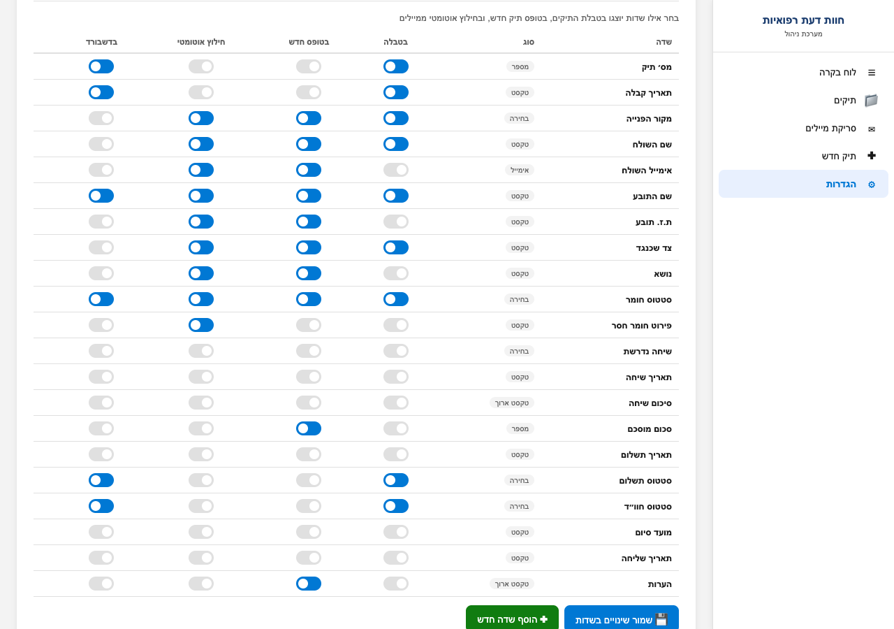

בדף **הגדרות → ניהול שדות** ניתן לשלוט אילו שדות יוצגו ואיפה. לכל שדה יש 4 מתגים:

| מתג | משמעות |
|---|---|
| **בטבלה** | האם השדה יוצג בעמודה בטבלת התיקים הראשית |
| **בטופס חדש** | האם השדה יופיע בטופס יצירת תיק חדש |
| **חילוץ אוטומטי** | האם המערכת תנסה לחלץ את השדה ממיילים ומצורפים |
| **בדשבורד** | האם השדה יוצג בטבלת "תיקים אחרונים" בלוח הבקרה |

לחץ **"שמור שינויים בשדות"** לאחר שינוי המתגים.

### הוספת שדה חדש
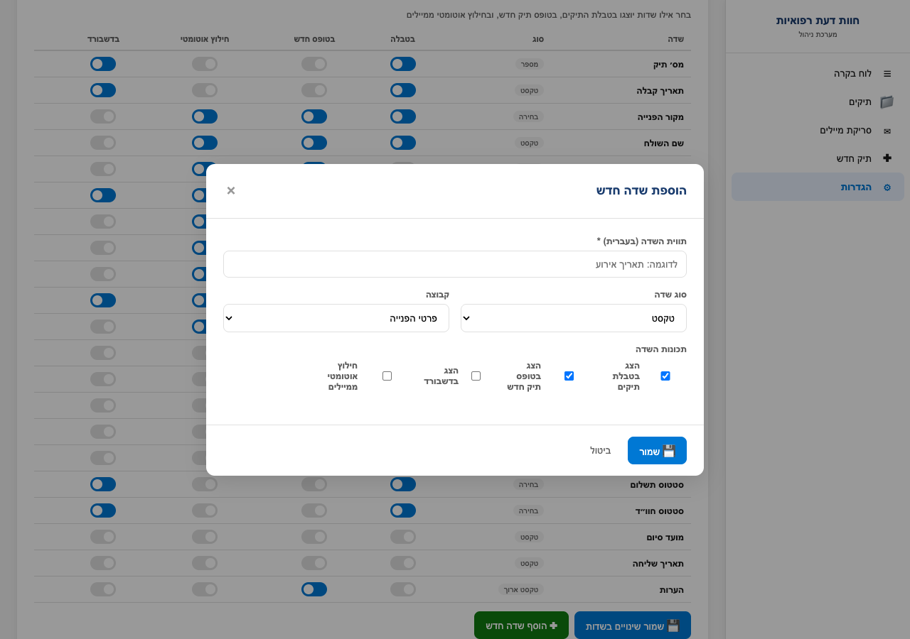

לחיצה על **"+ הוסף שדה חדש"** פותחת חלונית עם:
- **תווית השדה** - שם השדה בעברית (למשל "תאריך אירוע")
- **סוג השדה** - טקסט / מספר / טקסט ארוך / בחירה מרשימה / אימייל / תאריך
- **קבוצה** - באיזו סקציה יוצג בדף פרטי תיק (פרטי הפנייה / סטטוס וחומרים / שיחה עם התובע / תשלום)
- **אפשרויות** - רק עבור "בחירה מרשימה", אפשרויות מופרדות בפסיקים
- **תכונות** - איפה השדה יוצג ויפעל

לחץ **"שמור"**. השדה מופיע מיידית בכל המקומות:
- ✅ עמודה חדשה בקובץ ה-Excel (מתווספת אוטומטית, נתונים ישנים נשמרים)
- ✅ שדה בטופס תיק חדש
- ✅ שדה בדף פרטי תיק
- ✅ שדה במודל עריכה
- ✅ עמודה בטבלת התיקים (אם סומן)

ניתן לערוך או למחוק שדות מותאמים מטבלת ניהול השדות באמצעות הכפתורים בסוף השורה. **מחיקת שדה אינה מוחקת את הנתונים שכבר נשמרו** - העמודה ב-Excel נשארת אבל לא תוצג בממשק.

---

## עדכוני תוכנה

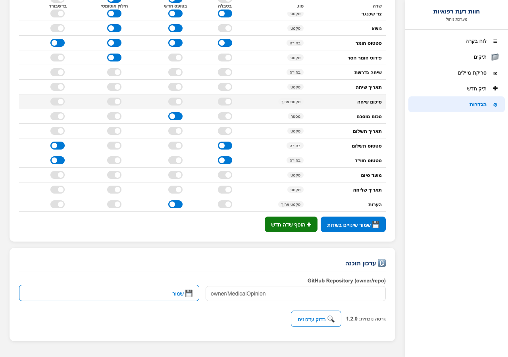

המערכת מתעדכנת באופן יזום מ-GitHub:

1. בדף **הגדרות**, גלול לסקציית **"עדכון תוכנה"**
2. ודא ששדה **"GitHub Repository"** מכיל `tal2420/MedicalOpinion`
3. לחץ **"בדוק עדכונים"**
4. אם יש גרסה חדשה - יוצגו פרטי הגרסה והערות השחרור
5. לחץ **"התקן עדכון"** - המערכת תוריד את הקבצים החדשים, תגבה את הקבצים הקיימים, ותחליף אותם
6. הפעל מחדש את האפליקציה

> ℹ️ **חשוב**: ההגדרות, התיקים, וקובץ ה-Excel שלך **לא יימחקו** בעת העדכון - רק קבצי האפליקציה מתעדכנים.

---

## שאלות נפוצות

### איפה נשמרים הנתונים?
בתיקיית העבודה (ברירת מחדל: `~/חוות_דעת_רפואיות`):
- `מאגר_תיקים.xlsx` - קובץ Excel מרכזי עם כל התיקים
- `תבנית_חוו״ד.docx` - תבנית מסמך חוות הדעת
- `config.json` - הגדרות האפליקציה
- `תיקים/` - תיקיית העל של כל התיקים, כל תיק עם:
  - `מייל_מקורי.html` - המייל המקורי שהתקבל
  - `פרטי_תיק.csv` - מטא-דאטה של התיק (פתיח ב-Excel)
  - `מצורפים/` - כל הקבצים שצורפו למייל
  - `חוות_דעת/` - מסמכי ה-Word של חוות הדעת

### האם ניתן לפתוח את הנתונים בלי האפליקציה?
**כן**. קובץ ה-Excel המרכזי `מאגר_תיקים.xlsx` ניתן לפתיחה ישירה ב-Excel - הוא מעוצב, מסונן, ומכיל את כל הנתונים. כך גם `פרטי_תיק.csv` בכל תיק וקבצי ה-Word של חוות הדעת.

### החילוץ האוטומטי מהמייל לא תפס את שם התובע - מה לעשות?
1. ודא שהמייל או אחד המצורפים מכיל את השם בפורמט מזוהה (למשל "שם התובע: ...", "התובע: ...", או בנושא המייל)
2. שמורים PDF סרוקים כתמונה לא ניתן לחלץ - הם דורשים OCR שאינו מותקן
3. ניתן להזין את השם ידנית באמצעות **"עריכת פרטים"** או להפעיל **"סרוק מצורפים"** מחדש

### האם המערכת תומכת בעוד התמחויות מלבד אורולוגיה?
**כן**. בהגדרות → פרטי הפרופסור, ניתן לשנות את שדה ה"התמחות" לכל ערך. השם שתכניס יופיע בכותרת ובחתימה של מסמכי חוות הדעת.

### מה קורה אם איבדתי את האימות לתיבת הדואר?
לך ל-**הגדרות → הגדרות דואר אלקטרוני**, הזן מחדש את הכתובת וה-App Password, ולחץ **"בדוק חיבור"**. אם בדיקת החיבור הצליחה - הכל פועל שוב.

### האם הנתונים שלי שמורים אצל מישהו חיצוני?
**לא**. כל הנתונים נשארים במחשב שלך בתיקייה המקומית. הסיסמאות נשמרות מקומית בקובץ הקונפיגורציה. רק התקשורת עם השרתים של Google/Gmail (לקריאה ושליחה של מיילים) ועם GitHub (לבדיקת עדכונים) יוצאת החוצה.

---

## תמיכה ועזרה

- **קוד פתוח ב-GitHub**: https://github.com/tal2420/MedicalOpinion
- **דיווח על באגים**: https://github.com/tal2420/MedicalOpinion/issues
- **גרסאות ושחרורים**: https://github.com/tal2420/MedicalOpinion/releases

---

*מערכת חוות דעת רפואיות - גרסה 1.2.0 ומעלה*
